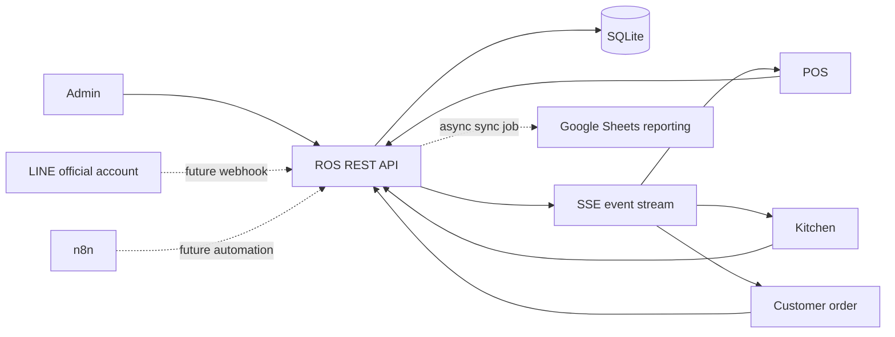

# System Architecture

ROS is a modular monolith: one Node.js service, one SQLite database, REST APIs for commands/queries, and SSE for server-to-device updates. It avoids a premature microservice split while keeping domains separated in source and data ownership.

Current code only implements the service shell, migration runner, `/health`, `/events`, and page placeholders. The diagram is a target architecture, not evidence that integrations work today.

Deployment target: a low-cost Linux VPS after the operational APIs are stable. Local Windows remains the development environment; the legacy stack remains independent.
