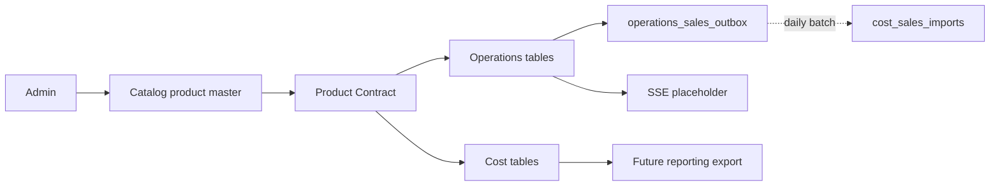

# System Architecture

`CONSTITUTION.md` is the controlling document. ROS is one Node.js modular monolith and one SQLite database, divided logically into Operations and Cost. Catalog is a small Admin-owned published product master, not a third full business domain.

Operations and Cost do not query each other's tables. The only cross-domain contracts are Product Contract and Sales Contract. Current code implements only the service shell, migration runner, contract definitions, guard tests, `/health`, `/events`, and page placeholders.

Google Sheets remains a future reporting export only. Local Windows remains the development environment; the legacy stack remains independent.
