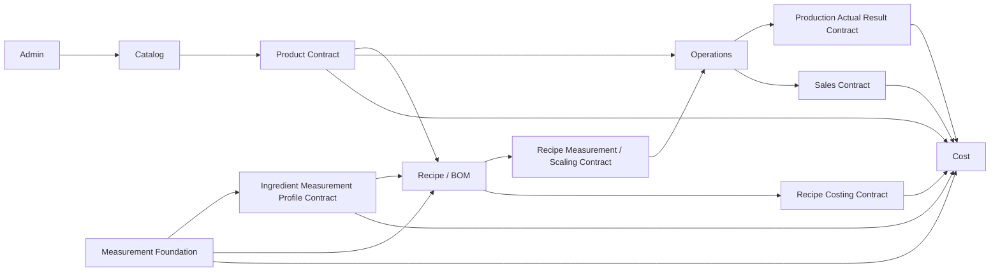

# System Architecture

`CONSTITUTION.md` is the controlling document. ROS is one Node.js modular monolith and one SQLite database with exclusive Catalog, Canonical Ingredient, Measurement, Recipe, Operations, and Cost authorities.

Measurement Foundation owns unit, dimension, exact conversion, locale policy, normalization, evidence, precision, and profile-validation semantics. Canonical Ingredient Identity Authority owns Ingredient identity and Measurement Profile identity, binding, lifecycle, versions, uniqueness, and history. Both are currently hosted in Recipe Core, but hosting does not transfer ownership to Recipe.

Recipe owns Recipe truth and canonical projection requests. Cost owns Quotes and costing evidence received through approved contracts. Recipe and Cost must not define independent conversion authority.

No authority reads another authority's tables or imports its internals. Approved business namespaces remain `catalog_*`, `recipe_*`, `operations_*`, and `cost_*`. Legacy Cost Ingredient, conversion, and BOM tables are non-authoritative skeletons.

Package Identity and Package Specification remain deferred. They are not Measurement Units. Taiwan `tw_catty` is Measurement-owned and always equals exactly `600 g`; no Profile or Supplier override is permitted.

Google Sheets remains a future reporting export only. Local Windows remains the development environment, and Legacy remains independent.
