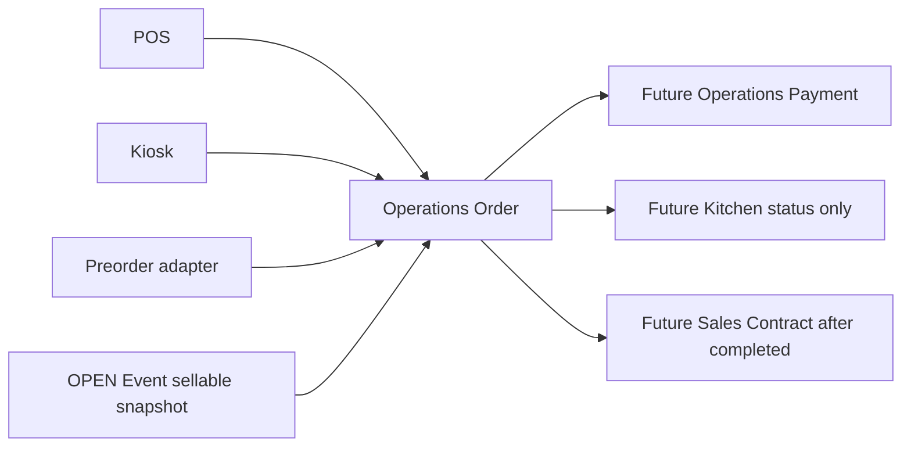

# Order Domain Policy

Status: Frozen design policy. Architecture Owner approved 2026-07-20. This document does not implement schema, API, UI, service, payment, Kitchen, scheduler, or integration.

Orders belong to the existing **Operations** domain. POS, Kiosk, and Preorder create the same central `Order` and immutable `OrderItem` snapshots. Every item uses the selected Event's Operations-owned Product Contract v2 snapshot; Orders never read Catalog or Cost internals.

## Frozen source policies

| Source | Initial state | Quantity at creation | Kitchen entry |
| --- | --- | --- | --- |
| POS | `confirmed`, `unpaid`, `not_started` | directly increase `soldQuantity`; never uses reserved | only after payment is `paid`, then queue |
| Kiosk | `submitted`, `unpaid`, `not_started` | increase `reservedQuantity` for 10 minutes | payment success confirms, converts reserved to sold, and queues |
| Preorder | `confirmed`, `unpaid`, `not_started` | directly increase `soldQuantity`; never uses reserved | POS manually sends it to Kitchen |

All sources share one Event-scoped sequence: `{eventCode}-{sequence}`, beginning at `001`. Cancellation never reuses a number. `orderId` remains the immutable system key; `source` remains a separate field.

## Frozen invariants

1. Order, payment, and production state are three independent state machines.
2. Every creation, idempotency decision, number allocation, and quantity update occurs in one Operations transaction.
3. `remainingQuantity` must never fall below zero.
4. A same-key same-payload retry returns the original Order; a same-key different-payload retry returns `409` and changes nothing.
5. `soldQuantity` is Event allocation, not proof of payment and not Sales Contract emission.
6. Sales Contract emits once only when `orderStatus` becomes `completed`; cancelled Orders never emit it.
7. After `preparing`, `ready`, or `served`, cancellation never restores `soldQuantity`; the accepted Cost/Waste gap is documented separately.
