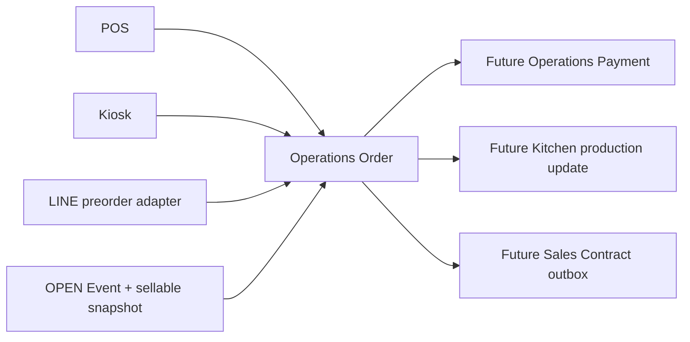

# Order Domain Design

Status: Design only. Proposed for Architecture Review. No schema, API, UI, or service is implemented by this document.

## Ownership and boundary

Orders belong to the existing **Operations** domain. Catalog remains the product publisher; Cost remains separate. An Order consumes only the Event's Operations-owned Product Contract v2 snapshot. It never reads `catalog_*`, `cost_*`, BOM, or ingredient data.

## One entity, source-specific rules

All sources create the same `Order` and `OrderItem` model. `source` is `pos`, `kiosk`, or `preorder`; it changes creation authority and reservation timing, not the data model.

| Source | Creator | Initial Order state | Quantity action | Notes |
| --- | --- | --- | --- | --- |
| POS | Staff | `confirmed` | reserve then immediately convert to `sold` in one transaction | Staff acceptance is the business confirmation; payment remains independent. |
| Kiosk | Customer | `submitted` | increase `reservedQuantity` | Awaiting staff/payment policy; first version must set an expiry. |
| Preorder | LINE adapter | `submitted` | increase `reservedQuantity` | Must pass Event preorder deadline and future preorder quota checks. |

The server validates an OPEN Event, the matching Event snapshot product version, positive quantity, and available quantity. Browser state, LINE payloads, and Google Sheets are never order authorities.

## Design invariants

1. `orderId` is immutable and machine-facing; `orderNumber` is human-facing and never reused.
2. Each item points to the selected Event snapshot `productVersionId`; later Catalog edits never alter history.
3. Order, payment, and production state are independent state machines.
4. Reservation changes and order creation must occur in one Operations database transaction.
5. One idempotency key represents one normalized create-order request only.
6. `soldQuantity` means firm Event allocation after confirmation. It is not proof that payment happened and does not emit a Sales Contract by itself.

See [ORDER_ENTITY.md](ORDER_ENTITY.md), [ORDER_STATE_MACHINE.md](ORDER_STATE_MACHINE.md), and [ORDER_QUANTITY_LIFECYCLE.md](ORDER_QUANTITY_LIFECYCLE.md).
