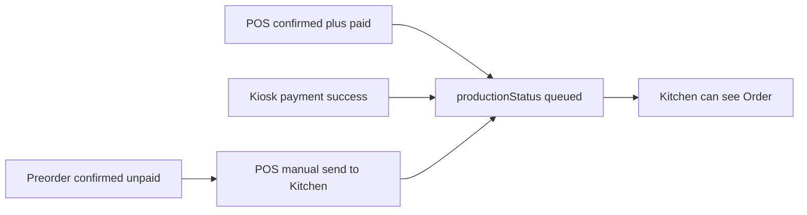

# Frozen Integration Points

| Interface | Allowed actions | Forbidden actions |
| --- | --- | --- |
| Admin | Read Orders; authorised cancellation/refund/manual correction with audit | Edit snapshots or bypass lifecycle/audit. |
| POS | Create direct-confirmed onsite Order; record future payment; queue paid POS/Kiosk; manually queue Preorder; mark served/completed | Edit Catalog, Cost, BOM, or Kitchen-owned transitions. |
| Kiosk | Submit Order and read its own result | Confirm, set payment, queue Kitchen, alter quantity. |
| Preorder adapter | Validate Event/deadline/quota/sellable availability then create confirmed preorder | Queue Kitchen automatically or change availability outside Order service. |
| Kitchen | `queued -> preparing -> ready`; allowed production cancellation exception | Change order/payment state, price, items, quantity, or availability. |

## Kitchen entry

Preorder is intentionally not auto-queued and no scheduler or advance-preparation design is allowed in this phase.

## Sales Contract

When and only when a POS/staff action sets `orderStatus = completed` after `paymentStatus = paid` and `productionStatus = served`, Operations will later write exactly one Sales Contract for that `orderId`. Payment, confirmation, Kitchen queue, preparing, ready, served, and any cancelled Order never emit it.
