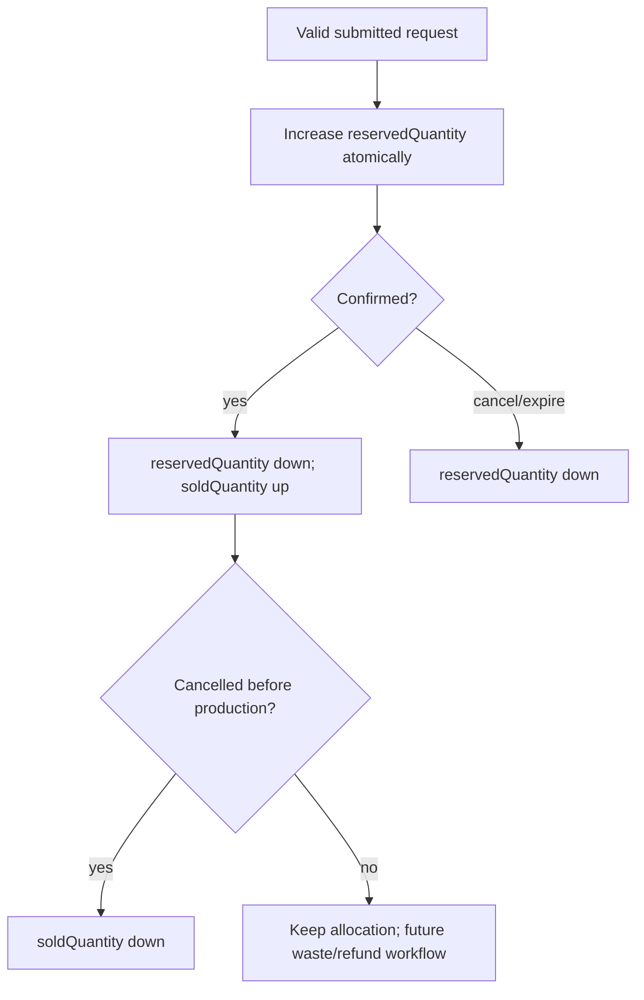

# Sellable Quantity Reservation Lifecycle

Current Event invariant remains:

```text
remainingQuantity = plannedQuantity - reservedQuantity - soldQuantity
```

## Recommended minimal policy

| Action | `reservedQuantity` | `soldQuantity` | `remainingQuantity` | Order state |
| --- | ---:| ---:| ---:| --- |
| Kiosk/Preorder valid create | + quantity | unchanged | decreases | `submitted` |
| POS staff create | temporary + quantity, then - quantity | + quantity | decreases | `confirmed` |
| Submitted confirmed | - quantity | + quantity | unchanged | `confirmed` |
| Submitted cancelled/expired | - quantity | unchanged | increases | `cancelled` |
| Confirmed cancelled before preparation | unchanged | - quantity | increases | `cancelled` |
| Confirmed cancelled after preparation/ready/served | unchanged | unchanged by default | unchanged | `cancelled` plus explicit waste/refund decision later |

`soldQuantity` here means a firm allocation to a confirmed order, not financial payment. Sales Contract emission remains tied to completed Order, not this counter.

## Atomicity and over-sale prevention

The future Operations application service must, in one SQLite transaction:

1. Load the OPEN Event's Operations snapshot row by `eventId` and `productVersionId`.
2. Check `remainingQuantity >= requestedQuantity`.
3. Update the appropriate quantity counters with a guarded condition.
4. Create the Order, items, idempotency record, and human number.

If the guarded update affects zero rows, return a sold-out conflict. Do not trust browser-calculated remaining counts. This is sufficient for the current single-node SQLite deployment; no queue or distributed lock is proposed.

## Timeout

Recommended first implementation: only `submitted + unpaid + not_started` Kiosk orders may expire automatically and release reservations. Preorder holds should not expire automatically once accepted; staff/customer cancellation rules apply. Exact Kiosk hold duration and preorder confirmation policy require Architecture Owner decision before implementation.


