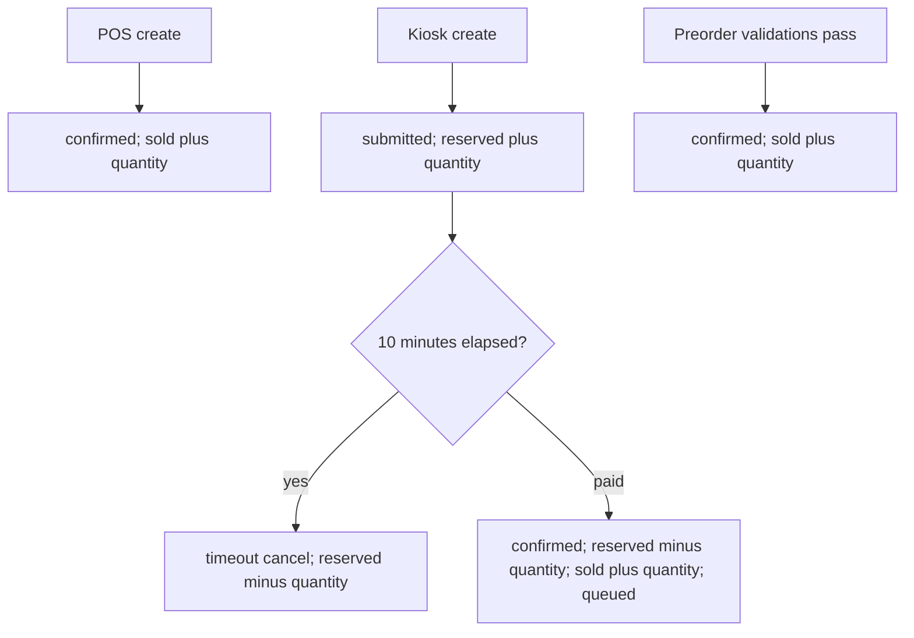
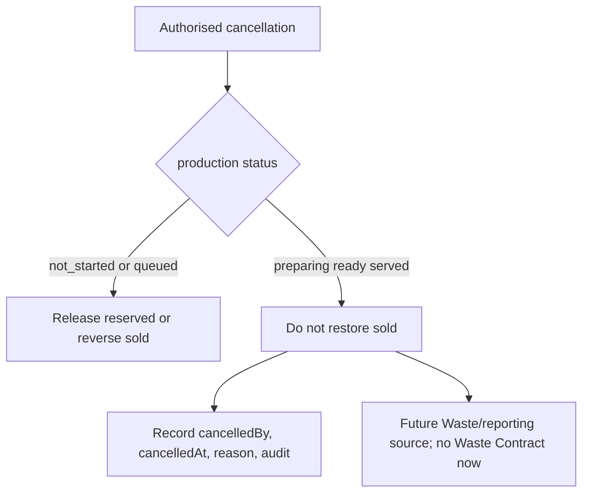

# Frozen Sellable Quantity Lifecycle

```text
remainingQuantity = plannedQuantity - reservedQuantity - soldQuantity
```

| Source / action | reserved | sold | Result |
| --- | ---:| ---:| --- |
| POS create | no change | `+ quantity` | Creates `confirmed`; no reserved stage. |
| Kiosk create | `+ quantity` | no change | Creates `submitted`, `unpaid`, `not_started`; holds 10 minutes. |
| Kiosk timeout | `- quantity` | no change | Cancels with reason `timeout`; number remains consumed. |
| Kiosk payment success | `- quantity` | `+ quantity` | Changes to `confirmed`, `paid`, `queued`. |
| Preorder success | no change | `+ quantity` | Creates `confirmed`, `unpaid`, `not_started`; deadline, preorder quota, and sellable checks must all pass. |
| Cancel before `preparing` | no change | `- quantity` for confirmed, or release reserve for submitted | Quantity returns to remaining. |
| Cancel at `preparing`, `ready`, or `served` | no change | no change | No restoration; cancellation reason, actor, timestamp, and audit are required. |

Every number allocation, idempotency check, Order/item write, and guarded counter update happens in one SQLite transaction. The guarded update must require adequate remaining quantity; zero affected rows means sold-out conflict. No client-side quantity calculation, queue, or distributed lock is authoritative.




