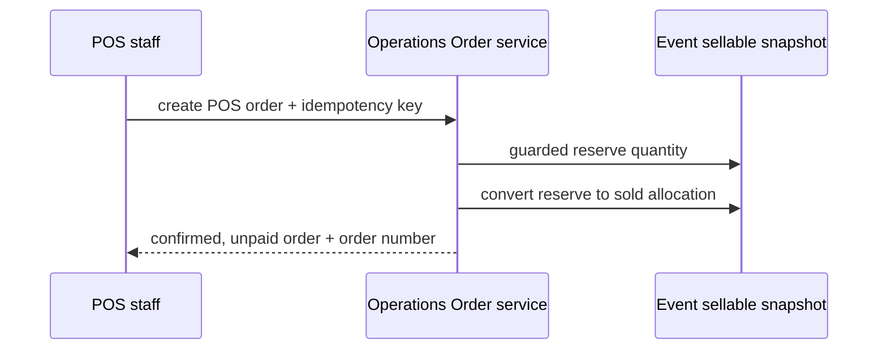
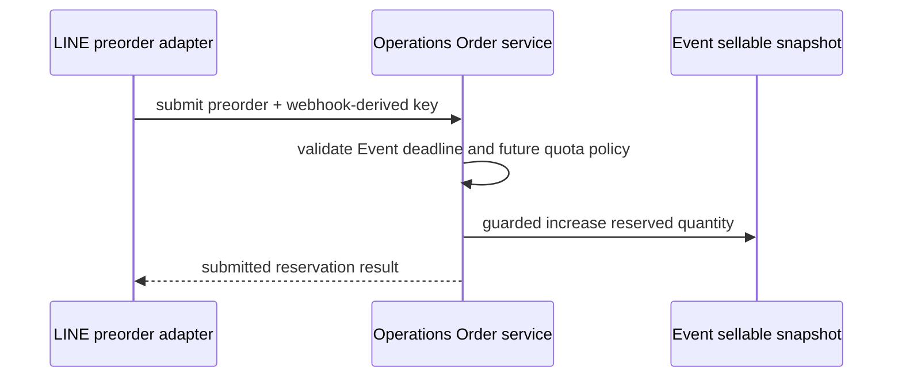
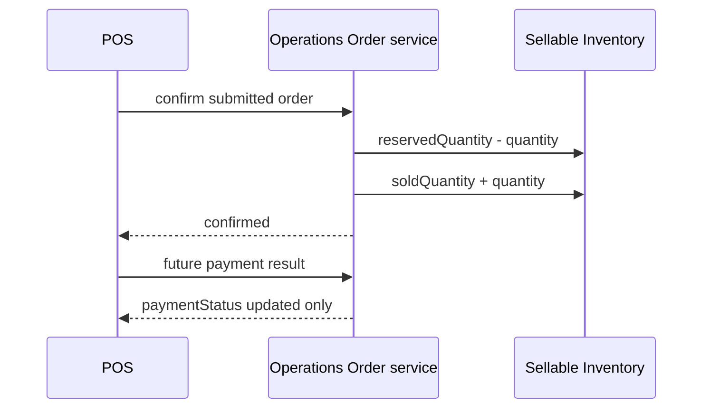
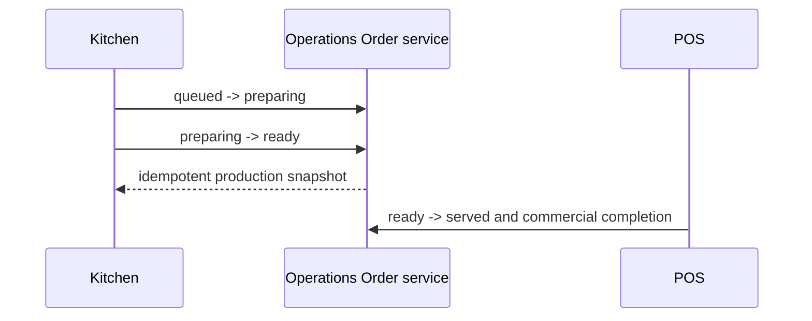

# Order Sequence Diagrams

## POS onsite order



## Kiosk order

```mermaid
sequenceDiagram
  participant Guest as Kiosk guest
  participant API as Operations Order service
  participant Event as Event sellable snapshot
  Guest->>API: submit order + retained idempotency key
  API->>Event: guarded increase reserved quantity
  API-->>Guest: submitted order result
  Note over API,Event: Retry with same key returns same Order; no second reserve
```

## Preorder order



## Payment and quantity conversion



## Cancel and release

```mermaid
sequenceDiagram
  participant Actor as Customer or staff
  participant Order as Operations Order service
  participant Event as Sellable Inventory
  Actor->>Order: cancel with reason
  alt submitted / not started
    Order->>Event: reservedQuantity - quantity
  else confirmed / not started
    Order->>Event: soldQuantity - quantity
  else preparing, ready, or served
    Note over Order,Event: no automatic restoration
  end
  Order-->>Actor: audited cancellation result
```

## Kitchen production states


