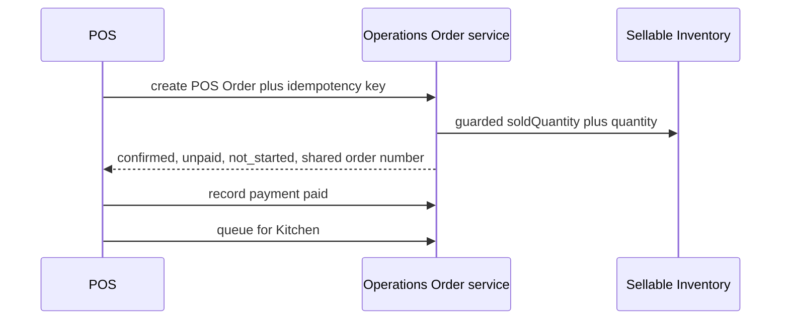
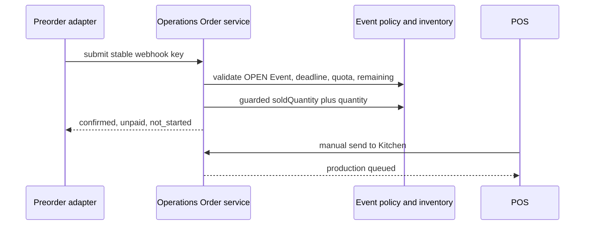
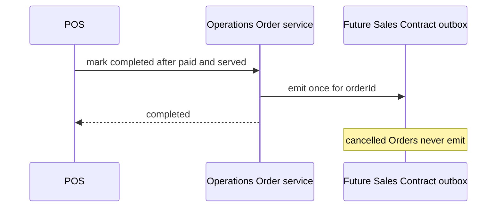

# Frozen Order Policy Diagrams

## POS direct sale allocation



## Kiosk ten-minute reservation

```mermaid
sequenceDiagram
  participant Kiosk
  participant Order as Operations Order service
  participant Event as Sellable Inventory
  Kiosk->>Order: submit plus retained idempotency key
  Order->>Event: guarded reservedQuantity plus quantity
  Order-->>Kiosk: submitted, unpaid, not_started
  alt paid within ten minutes
    Order->>Event: reserved minus quantity; sold plus quantity
    Order-->>Kiosk: confirmed, paid, queued
  else timeout
    Order->>Event: reserved minus quantity
    Order-->>Kiosk: cancelled with timeout reason
  end
```

## Preorder automatic confirmation



## Completed to Sales Contract


