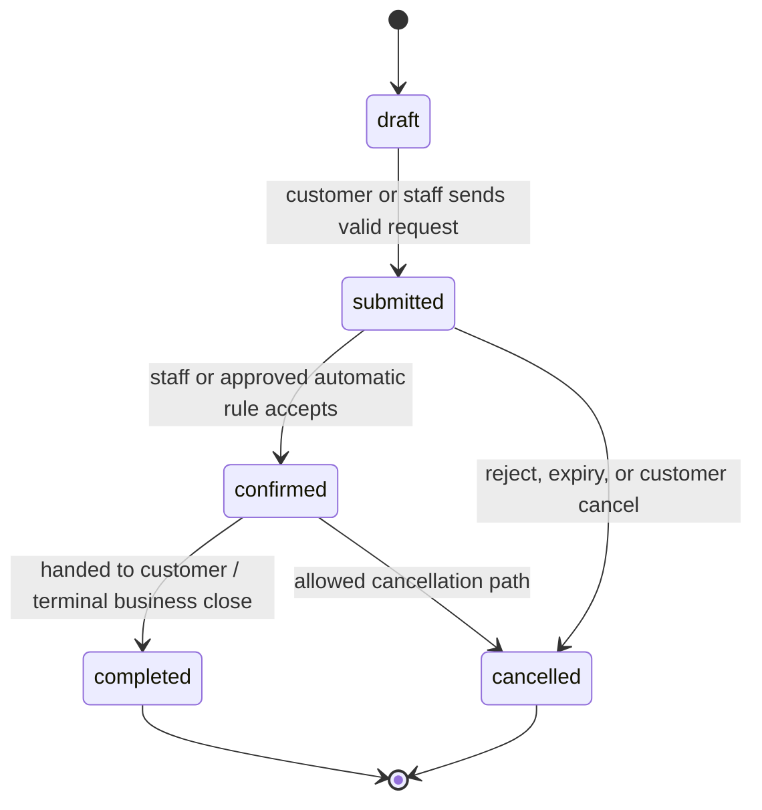
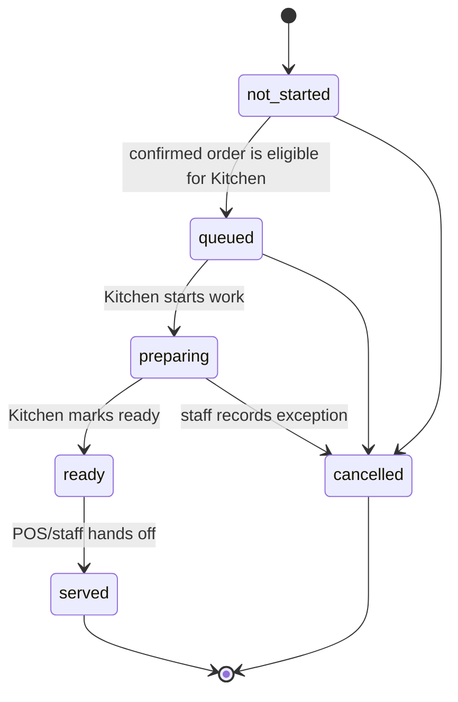

# Separate Order, Payment, and Production States

## Why three states

`orderStatus` answers whether the commercial request exists and is accepted. `paymentStatus` answers money collection. `productionStatus` answers preparation. None implies either of the other two.

## Order state

`draft` is server-side composition only and must not reserve quantity. `submitted` has passed validation and may hold a reservation. `confirmed` is a firm Event allocation. `completed` means the commercial handoff is complete, not merely paid or cooked.

## Payment state

| State | Meaning | Does not imply |
| --- | --- | --- |
| `unpaid` | No accepted payment | cancellation, Kitchen completion |
| `pending` | Future electronic payment awaiting result | confirmed order |
| `paid` | Payment recorded | served/completed order |
| `partially_refunded` | Some paid amount returned | order cancellation |
| `refunded` | Paid amount fully returned | quantity restoration |
| `failed` | Attempt failed | automatic order cancellation |

## Production state

Kitchen may update only production state through an Operations application service. Kitchen cannot change item, price, payment, order lifecycle, or availability quantities.
