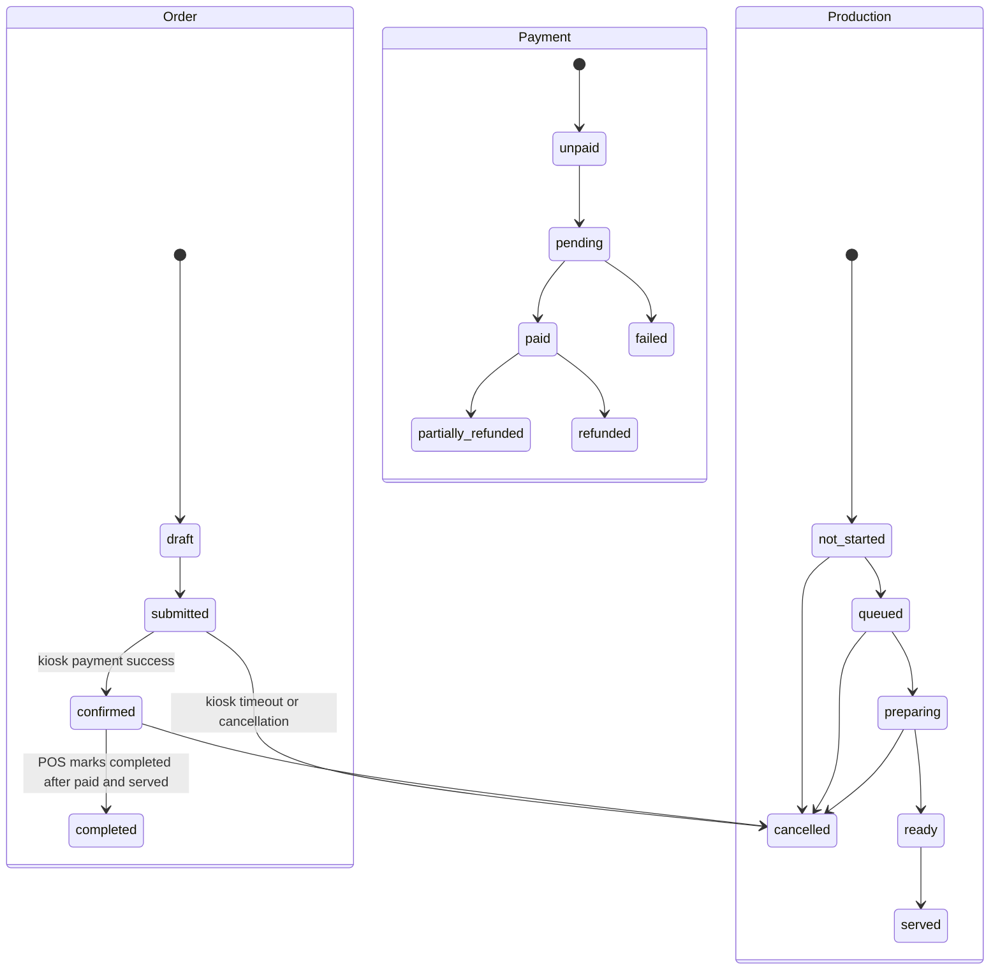

# Frozen Three-track State Model

`orderStatus`, `paymentStatus`, and `productionStatus` must never be merged. A transition in one does not implicitly transition either of the others unless an explicit Operations command defines both changes.

## `orderStatus`

| State | Allowed actor / transition |
| --- | --- |
| `draft` | Server-side composition only; no quantity effect. |
| `submitted` | Kiosk creates it; Kiosk timeout or authorised cancellation moves it to `cancelled`. |
| `confirmed` | POS creates directly; Kiosk payment success confirms; Preorder creates directly. |
| `completed` | POS/staff only, after **both** `paymentStatus = paid` and `productionStatus = served`. |
| `cancelled` | Kiosk timeout, authorised customer policy, POS/Admin cancellation. |

## `paymentStatus`

First-version values: `unpaid`, `pending`, `paid`, `failed`, `partially_refunded`, `refunded`. Payment does not complete the Order and does not itself change production state.

| Payment transition | Allowed actor |
| --- | --- |
| unpaid to pending | POS or approved payment adapter. |
| pending to paid / failed | Approved payment adapter, or POS records approved cash. |
| paid to partially_refunded / refunded | Admin or authorised POS role with audit and payment reference. |

## `productionStatus`

First-version values: `not_started`, `queued`, `preparing`, `ready`, `served`, `cancelled`.

| Production transition | Allowed actor |
| --- | --- |
| not_started to queued | POS only: after POS/Kiosk payment is paid, or manual Preorder release. |
| queued to preparing | Kitchen only. |
| preparing to ready | Kitchen only. |
| ready to served | POS/staff only. |
| not_started / queued / preparing to cancelled | Authorised POS/Admin; Kitchen may only record an approved production exception through Operations. |

Kitchen must not modify Order, payment, prices, item data, or quantities.
